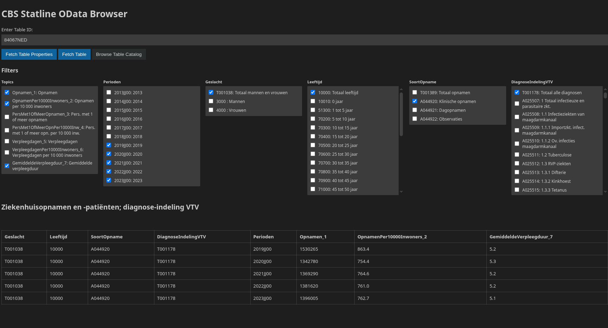

## Features
Adds a UI for browsing CBS Statline Tables using the OData (v3) API. Did this as a project to learn how to make VSC Extensions.

## Requirements
None

## Extension Settings
None

## Known Issues
None

## Release Notes

### 1.0.0
- Add table catalog for QoL Table selection
- Render table if filter properties are cached
- Status shows if table fetch had to be truncated 
- Add Content Security Protocol (CSP)

### 0.1.2
Filter list max length longer

### 0.1.1
Remove logs/lower version for compatability

### 0.1.0
Move view to editor

### 0.0.2
Added topic selection

### 0.0.1
MVP